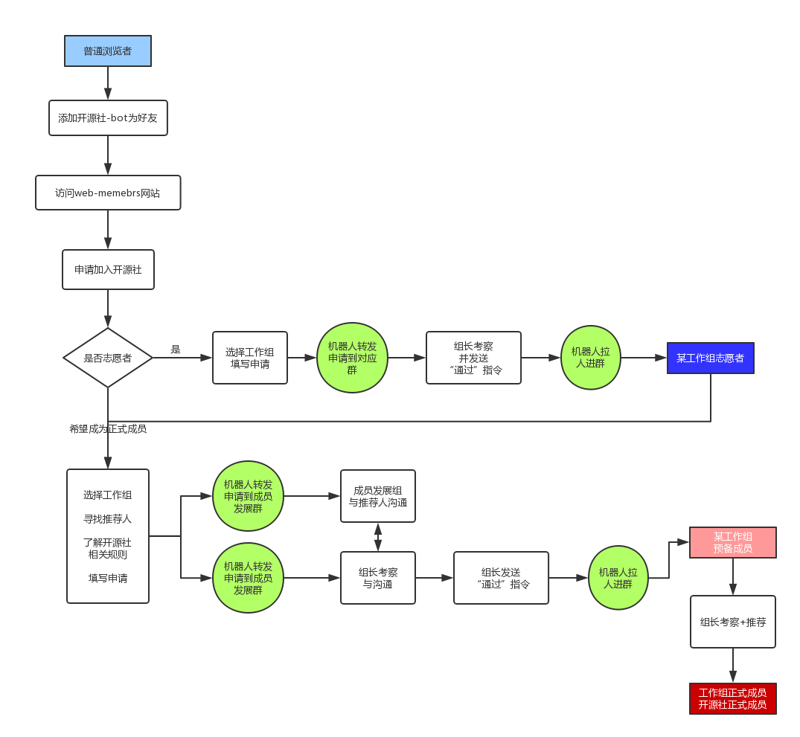

# web-members

## 工作流程

## 相关User Story

* 普通用户
    * 浏览开源社官网或订阅开源社公众号，选择我要加入开源社
        * 跳转到开源社申请加入页面
    * 选择成为开源社志愿者 or 开源社正式成员
        * 展示相应的流程介绍
        * 提示用户，先加“开源社-bot”为好友
        * 如果选择成为正式成员，需要填写2位开源社正式成员，作为介绍人
    * 用户加“开源社-bot”为好友
        * 在“wechat_friends”表中添加记录
    * 用户填写申请表并提交
        * 查找“wechat_friends”，确认是否已经添加微信好友
        * 转发申请信息到对应微信群
* 开源社工作组组长
    * 决定是否接受“志愿者”申请
        * 审查申请者的申请信息
        * 发布“@开源社-bot 接受@用户名”的指令
        * 开源社-bot将会把该用户，拉入本群
    * 决定是否接受“正式成员”申请
        * 审查申请者的申请信息
        * 与成员发展组交流，确认介绍人信息
        * 发布“@开源社-bot 接受@用户名”的指令
        * 开源社-bot将会把该用户，拉入本群
        * 该申请人，成为本工作组“预备成员”
    * 决定是否将“预备成员”转为“正式成员”
        * 组长与成员工作组沟通、报备
        * 发布“@开源社-bot 转正@用户名”的指令
        * 开源社-bot将会把该用户的status，从“预备成员”，改为“正式成员”
* 成员发展组
    * 决定是否接受“正式成员”申请
    * 审查申请者的申请信息
    * 与介绍人交流，了解申请人的情况
    * 与工作组组长交流，反馈相关情况
